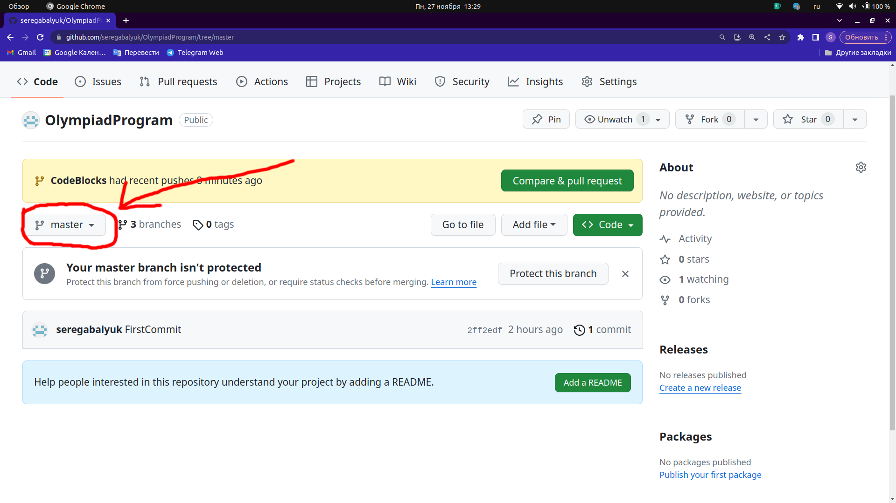
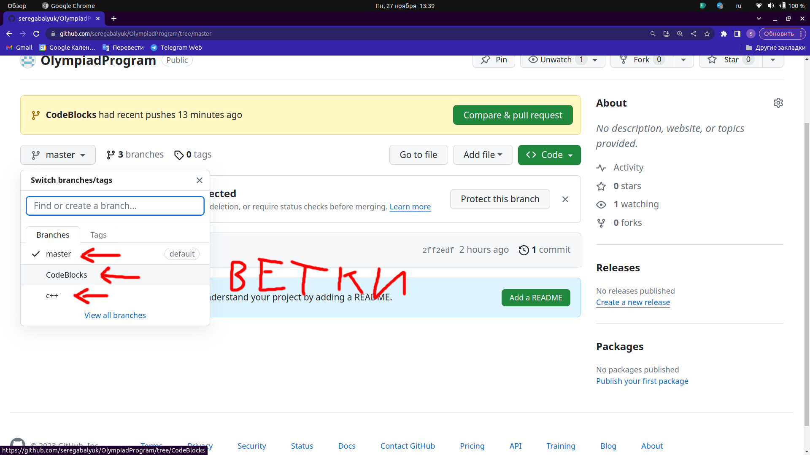

# Олимпиадное программирование
Это курс по олимпиадному программированию.
Здесь будут основные материалы.

## Ссылки

[Телеграм канал с объявлениями](https://t.me/+NW1sDdOQji1lODMy)

[ссылка на телеграм чат](https://t.me/+qEHXpe7mnPYwMGQy)

## Материалы
1. [Codeblocks](https://github.com/seregabalyuk/OlympiadProgram/tree/CodeBlocks): ветка с материалами Codeblocks:
   - [Установка](https://github.com/seregabalyuk/OlympiadProgram/tree/CodeBlocks/install)
2. [с++](https://github.com/seregabalyuk/OlympiadProgram/tree/c++): ветка с материалами по с++:
   - [Основы (типы и операции)](https://github.com/seregabalyuk/OlympiadProgram/tree/c++/%D0%BE%D1%81%D0%BD%D0%BE%D0%B2%D1%8B)
   - [Ввод и вывод](https://github.com/seregabalyuk/OlympiadProgram/tree/c++/%D0%92%D0%B2%D0%BE%D0%B4%D0%92%D1%8B%D0%B2%D0%BE%D0%B4)
   - [Условия и тело](https://github.com/seregabalyuk/OlympiadProgram/tree/c++/%D0%A3%D1%81%D0%BB%D0%BE%D0%B2%D0%B8%D1%8F)
   - [Циклы](https://github.com/seregabalyuk/OlympiadProgram/tree/c++/%D0%A6%D0%B8%D0%BA%D0%BB%D1%8B)
   - [Функции](https://github.com/seregabalyuk/OlympiadProgram/tree/c++/%D0%A4%D1%83%D0%BD%D0%BA%D1%86%D0%B8%D0%B8)
   - [Std](https://github.com/seregabalyuk/OlympiadProgram/tree/c++/std)
   
3. algorithm: ветка с алгоритмами (пока не добавил)
4. homework: ветка с заданиями (пока не добавил)

### как открыть
Чтобы посмотреть материалы, нажмите на ветку и выбирете нужную

